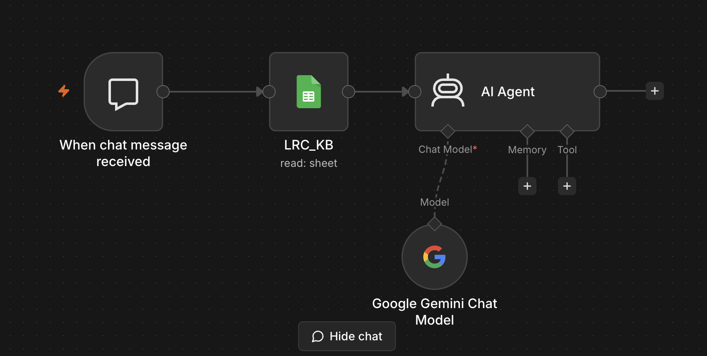

# LRC Guide — AI Front-Desk Assistant
### *Language Resource Center · Grand Valley State University*


> An AI-powered chat assistant built with **n8n**, **Google Gemini**, and **Google Sheets** to serve as a 24/7 virtual front desk for the Language Resource Center at GVSU.

---

## Overview

**LRC Guide** (internally nicknamed *Digital Stoplight*) is a conversational AI agent that helps students, faculty, and visitors get instant answers about the Language Resource Center — without waiting for a staff member.

It was built and deployed by **Kuladeep Roy**, a data science student working part-time at the LRC, as a practical automation to reduce repetitive front-desk inquiries and improve the student experience.

### What it answers
- 📍 LRC location and directions within Mackinac Hall
- 🕐 Hours of operation
- 💻 Technology help — DILL software, Panopto, VR headsets, headsets, webcams
- 📋 Lab rules — noise, food/drink, check-in/check-out
- 🌍 Events — conversation tables, cultural nights, trivia, film screenings
- 🗣️ Language learning resources and tutoring support
- 📞 Contact information for the front desk

---

## 🏗️ Architecture

```
User Message (Chat UI)
        │
        ▼
┌─────────────────────────┐
│   n8n Chat Trigger       │  ← Webhook-based chat interface
│  (When message received) │
└────────────┬────────────┘
             │
             ▼
┌─────────────────────────┐
│   Google Sheets Node     │  ← Fetches live KB from LRC_Knowledge_Base sheet
│       (LRC_KB)           │
└────────────┬────────────┘
             │
             ▼
┌─────────────────────────┐
│      n8n AI Agent        │  ← Combines KB + system prompt → sends to LLM
│  (LangChain Agent node)  │
└────────────┬────────────┘
             │
             ▼
┌─────────────────────────┐
│  Google Gemini 2.5       │  ← Generates warm, human-like responses
│    Flash Lite (LLM)      │
└─────────────────────────┘
             │
             ▼
    Response sent back to user
```

---

## 🛠️ Tech Stack

| Component | Tool / Service |
|---|---|
| Workflow Automation | [n8n](https://n8n.io) (self-hosted or cloud) |
| AI Model | Google Gemini 2.5 Flash Lite (via Google PaLM API) |
| Knowledge Base | Google Sheets (fetched live per request) |
| Agent Framework | n8n LangChain Agent node |
| Trigger | n8n Chat Trigger (Webhook) |

---

## 💡 Key Design Decisions

**Google Sheets as the Knowledge Base**  
Instead of hardcoding FAQs into the prompt, the agent fetches a live Google Sheet on every request. This means non-technical staff can update the KB — add new questions, edit hours, update event info — without touching the workflow at all.

**Gemini 2.5 Flash Lite**  
Chosen for its speed and cost-efficiency on a repetitive Q&A workload. The model handles conversational tone well without needing a larger, slower model.

**System Prompt as the "Personality Layer"**  
The agent is given a detailed persona — warm, student-centered, never robotic — along with strict behavior rules (never invent policies, never show raw JSON, always match KB entries first). This keeps responses consistent and on-brand.

---

## 🚀 Setup & Replication

### Prerequisites
- n8n instance (cloud or self-hosted)
- Google Cloud project with **Gemini API** (PaLM API) enabled
- Google Service Account with **Sheets API** access

### Steps

1. **Clone this repo**
   ```bash
   git clone https://github.com/YOUR_USERNAME/lrc-guide-agent.git
   ```

2. **Import the workflow into n8n**
   - Open your n8n instance
   - Go to **Workflows → Import from file**
   - Select `workflow/LRC_Guide_workflow.json`

3. **Set up credentials in n8n**
   - `Google Gemini (PaLM) API` → add your Gemini API key
   - `Google Service Account` → upload your service account JSON

4. **Create your Knowledge Base**
   - Copy the [KB template structure](#knowledge-base-structure) into a Google Sheet
   - Share the sheet with your service account email
   - Update the Google Sheets node in n8n with your Sheet ID

5. **Activate the workflow**
   - Click **Active** toggle in n8n
   - Use the Chat Trigger URL to embed the chat widget

---

## 📊 Knowledge Base Structure

The agent reads from a Google Sheet with this column structure:

| Column | Description |
|---|---|
| `Type` | Category of the entry (e.g., `Hours`, `Location`, `Tech Support`) |
| `Topic` | Short topic label |
| `Question_keywords` | Keywords the agent uses to match the user's question |
| `answer_text` | The main answer text |
| *(optional)* | Phone, email, links, locations, or additional fields |

Any column can be referenced by the agent — it's not limited to `answer_text`. Staff can add columns (e.g., `updated_date`, `staff_note`) freely.

---

## 📸 Demo

> *(Add a screenshot or GIF of the chat widget in action here)*

---

## 🔒 Privacy & Deployment Notes

- No personal student data is collected or stored
- The knowledge base contains only publicly available LRC information
- Credentials (API keys, service account) are **never** committed — see `.env.example`
- The workflow JSON in this repo has all credential IDs removed

---

## 📁 Repo Structure

```
lrc-guide-agent/
├── workflow/
│   └── LRC_Guide_workflow.json     # Importable n8n workflow (sanitized)
├── docs/
│   └── architecture.png            # Flow diagram
├── kb-template/
│   └── LRC_KB_template.csv         # Sample knowledge base structure
├── .env.example                    # Required environment variables
├── LICENSE
└── README.md
```

---

## 🤝 Acknowledgments

Built for the **Language Resource Center** at **Grand Valley State University**.  
Thanks to the LRC staff for guidance on what students actually ask about.

---

## 📄 License

MIT License — feel free to adapt this for your own department or institution.
